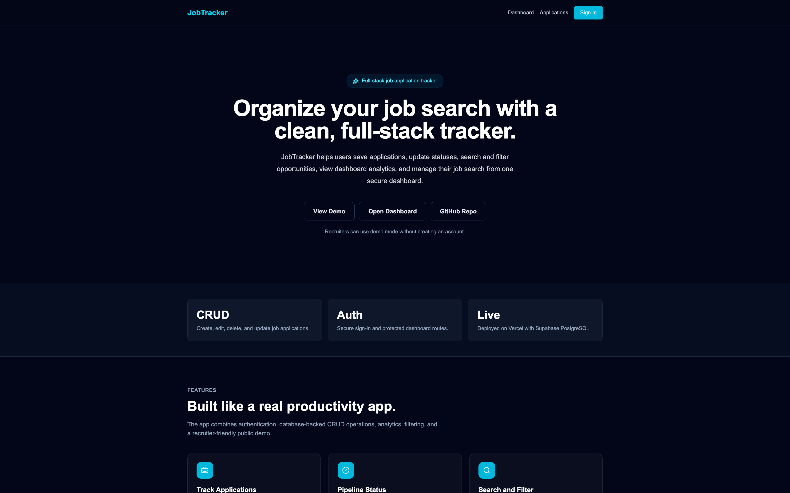
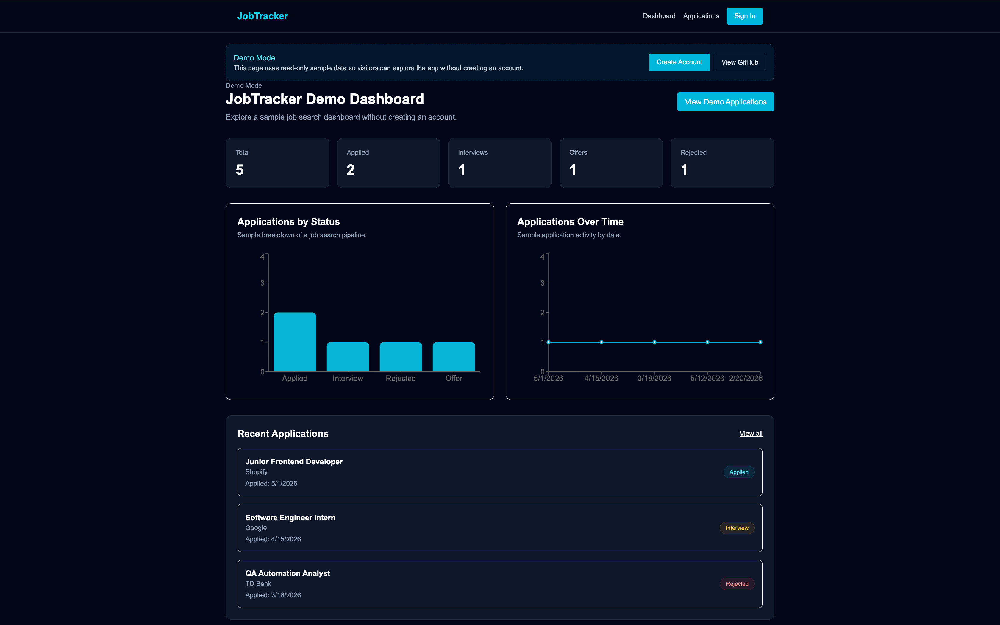
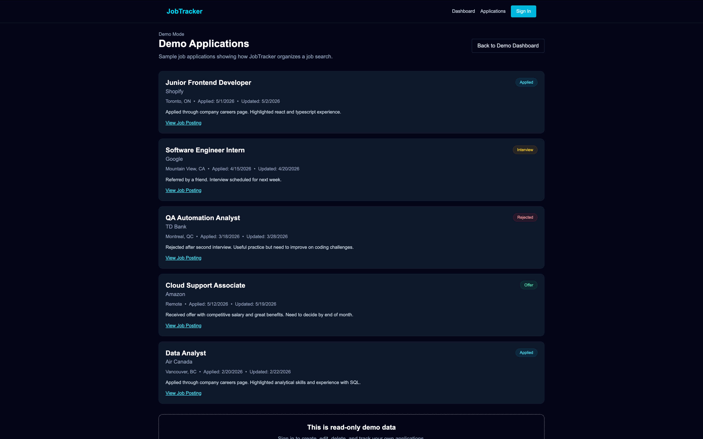

# JobTracker

JobTracker is a full-stack job application tracking web app that helps users organize their job search, monitor application progress, and manage interview pipelines in one place.

## Features

- User authentication with Clerk
- Protected dashboard routes
- Add, edit, delete, and search job applications
- Filter applications by status
- Sort applications by applied date
- Quick status updates directly from the applications page
- Dashboard analytics for total applications, interviews, rejections, and offers
- Responsive design for desktop, tablet, and mobile

## Tech Stack

- Next.js
- React
- TypeScript
- Tailwind CSS
- Clerk
- Prisma
- PostgreSQL
- Supabase
- Vercel

## Screenshots

### Homepage


### Demo Dashboard


### Demo Applications



## Getting Started

Clone the repository:

```bash
git clone https://github.com/dahhren/job-tracker.git